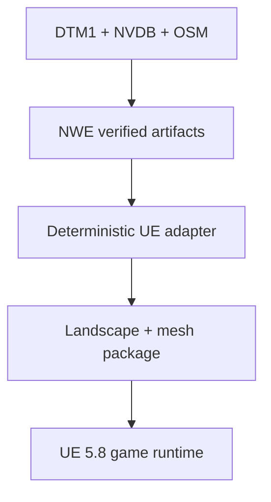

# 09 — Nannestad Unreal game plan

**Status:** ACTIVE — 2026-09-04
**Runtime:** Unreal Engine 5.8, Windows PC, third person
**First world slice:** `epsg25832_611000_6677000_1000m`

## Product lock

Build a realistic, human-scale game in real Nannestad. The first deliverable is
an honest exploration vertical slice because no combat, survival, driving or
other game loop has yet been selected. It must be possible to add that game
design without replacing the map pipeline.

The previous Three.js vertical remains reference evidence. It is not the game
runtime and must not constrain Unreal architecture.

## Architecture

The NWE compiler remains authoritative for geographic data, CRS, datum,
provenance and identity. Unreal owns presentation, collision, animation,
lighting and disposable runtime realization.

## Implemented foundation

- UE 5.8 C++ project with DX12/SM6, Lumen GI/reflections, Virtual Shadow Maps,
  Sky Atmosphere, movable sun/skylight, volumetric fog and clouds;
- immutable snapshot pin and canonical full-graph provenance verification;
- explicit EPSG:25832 + NN2000 → UE transform: X east, Y south, Z up, 100 cm/m;
- deterministic 1009 × 1009 16-bit Landscape heightmap with recorded import
  location/scale and quantization bound;
- deterministic chunked terrain, NVDB road and OSM building mesh packets;
- verified renderer-neutral NHM DOM-DTM building-surface handoff: current slice
  resolves 15 OSM source heights + 105 guarded DOM-derived presentation heights
  + 15 explicit fallbacks while preserving exact footprint/building identity;
- collision on terrain/building bootstrap geometry;
- code-owned third-person character using Epic's Quinn mesh and animation
  content, with keyboard/gamepad movement, jumping and follow camera;
- Open World template setup script and hash-verified local CC0 PBR material import;
- Epic/Cinematic PC graphics presets with TSR, Lumen, VSM, virtual textures,
  anisotropic filtering and physically scaled daylight;
- generated-data exclusion from Git and offline-at-runtime packaging rules.

The procedural terrain mesh is a bootstrap that makes the verified data
immediately consumable. Native Landscape is the production terrain target.

## Truth boundary

| Layer | Source-backed now | Presentation-only now | Required before fidelity claim |
|---|---|---|---|
| Terrain | DTM1 elevation, EPSG:25832, NN2000 | mesh resampling and r16 quantization | UE render/collision comparison |
| Roads | NVDB centerline and elevation | class-based width, 5 cm lift | admitted width/lane/surface fields |
| Buildings | OSM footprint/type + 15 OSM heights; Kartverket NHM DOM-DTM distributions for 132 footprints | guarded p90 height for 105 unresolved buildings, 15 remaining height fallbacks, fallback roof shape/ridge orientation; DOM relief may only drive presentation roof rise | surveyed/admitted roof shape/ridge/eave or high-confidence separately versioned inference; richer relations/façades |
| Materials | stable material roles; pinned CC0 map identity | generic Poly Haven surface mapping and tint | land-cover/façade semantics plus UE frame review |
| People | Epic Quinn is a real skeletal human character asset | identity/wardrobe | authored cast/MetaHuman decision if required |

No fallback is allowed to flow back into canonical world truth. “Realistic” is
not accepted merely because Lumen is enabled; it requires an actual render,
asset and performance gate.

## Execution gates

### UE5-FOUNDATION — implemented, editor validation open

The converter, C++ runtime, project configuration, setup script and unit/real-
snapshot integration checks exist. This gate closes only after UE 5.8 compiles
them on Windows.

### UE5-RUN-01 — first active gate

On a Windows UE 5.8 machine:

1. run `SetupNannestad.ps1` against a clean checkout;
2. compile `NannestadEditor` with no errors;
3. create `/Game/Maps/Nannestad` from the Open World template;
4. start Play-in-Editor and prove Quinn spawns, animates, walks, jumps and
   collides with the real terrain/buildings;
5. capture log evidence that 21 verified derived mesh packets loaded and that
   no raw Kartverket/NVDB/OSM request occurred;
6. capture a frame plus `stat unit`, `stat gpu`, primitive/draw and memory data.

### UE5-LANDSCAPE-01

Import the generated `.r16` into native Landscape/World Partition using the
recorded transform. Compare representative UE world heights against source
DTM1, preserve north/south orientation, then remove runtime terrain mesh
collision only after parity is proven.

Nanite Landscape is a measured option, not a default. It does not add source
resolution and carries both Nanite and regular Landscape streaming data.

### UE5-VISUAL-01

The first asset/quality slice is implemented: pinned local Poly Haven terrain,
asphalt, timber-wall and roof maps; DirectX-normal import; realistic daylight;
and Epic/Cinematic render settings. Remaining acceptance is terrain layer masks,
source-backed Norwegian vegetation, road markings and controlled exposure/color
grading in an actual UE frame. No fallback material may be mistaken for final
geographic art.

### UE5-GEO-01

**Partial pass:** building-height enrichment is now materially advanced. The
engine-neutral NHM DOM-DTM candidate is hash-bound to the exact accepted OSM
building artifact and the Unreal adapter uses guarded p90 only for unresolved
heights that pass sample/plausibility gates. Current result is 15 OSM source
heights + 105 DOM-derived presentation heights + 15 explicit fallbacks.

Roof shape remains open: this OSM snapshot contains zero admitted roof-shape
fields. DOM p95-p25 relief may influence only the rise of an already
presentation-classified pitched roof. A separately versioned strong DOM-DTM
direction candidate now exists for 30/135 buildings and is deterministic across
hosted compiles; Unreal applies 10 of those directions to existing presentation
gables. It never creates roof shape, overrides a source roof or claims surveyed
ridge/eave geometry. Concave/complex hipped footprints remain on explicit apex
fallback rather than being convex-hull simplified.

Remaining gate: admitted road width/lane/surface semantics plus actual
source/admitted roof-shape/ridge/eave semantics and richer building
relations/façades. Missing values remain visibly classified, never silently
guessed.

### UE5-PACKAGE-01

Produce a Windows Development package and run the same movement/collision/data-
identity smoke outside the editor. Record frame-time and memory budgets before
expanding beyond the first tile.

## Explicit deferrals

- neighboring tiles and whole-Norway streaming;
- interiors and exact façade reconstruction;
- final MetaHuman cast;
- vehicles, traffic, NPC AI, networking and persistence;
- final game genre/loop;
- orthophoto until license, caching and redistribution are proven.

These are product work, not excuses to weaken the current geographic or visual
acceptance gates.
